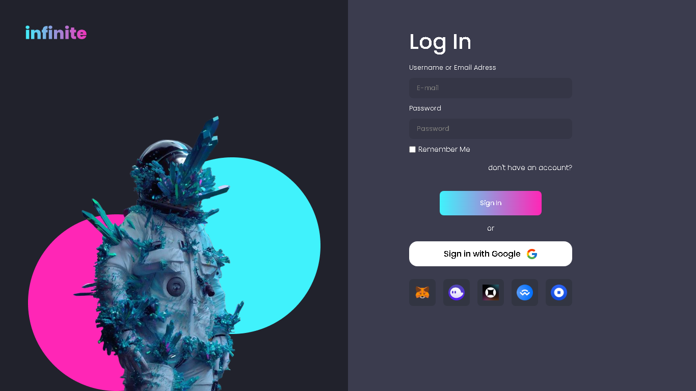
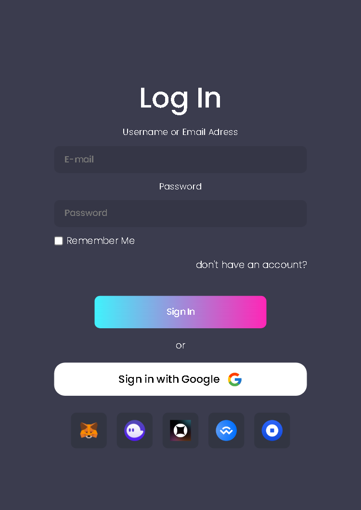

## 👀 Overview
 
 O projeto é uma tela de Log In responsiva para um mercado de criptomoedas criado em HTML e CSS 
 
 Você pode ver o projeto funcionando [AQUI](https://vbrianb.github.io/Infinite/)
 
 
 
 <h2 align="center"> Desktop</h3>
  
  
  
 <h2 align="center"> Mobile</h2>
 

 

 

## O que são criptomoedas?

Criptomoeda é o nome genérico para moedas digitais descentralizadas, criadas em uma rede blockchain a partir de sistemas avançados de criptografia que protegem as transações, suas informações e os dados de quem transaciona. 

Criptomoedas são moedas digitais porque, diferentemente do real, do dólar e de outras moedas que podem ser tocadas, elas só existem na internet. Ou seja, você sabe que elas são verdadeiras, mas não consegue pegá-las com as mãos – ou guardá-las na carteira, no cofre ou embaixo do colchão.

Descentralizadas porque não existe um órgão ou governo responsável por controlar, intermediar e autorizar emissões de moedas, transferências e outras operações. Quem faz isso são os próprios usuários.

Criadas em uma rede blockchain porque é essa tecnologia que está por trás das criptomoedas. Basicamente, blockchain é um sistema que permite o envio e o recebimento de alguns tipos de informação pela internet. Ela funciona como um grande banco de dados em que pedaços de código carregam informações conectadas, como blocos que formam uma corrente – por isso o nome “corrente de blocos”.

E em sistemas de criptografia porque é essa camada de segurança, garantida pela blockchain, que possibilita a emissão e a transação de moedas virtuais de forma mais segura. É dessa tecnologia, inclusive, que vem o nome criptomoeda – moeda criptografada.

 

## Como as criptomoedas são criadas? 

Como você viu, as criptomoedas nascem em redes blockchain. E é isso que as diferencia de outros criptoativos, como tokens e NFTs. E como acontece esse “nascimento”? Depende. As principais criptomoedas são mineradas. 

A mineração de criptomoedas é o processo responsável por validar os dados na blockchain. Nele, vários mineradores tentam achar a solução de equações complexas com seus computadores ao mesmo tempo, na base da tentativa e erro. 

Minerar criptomoeda não é uma tarefa simples. Para fazer isso, é necessário ter um computador com alta capacidade de processamento – muito mais do que os computadores pessoais comuns. Por isso, os mineradores compram máquinas específicas para minerar. 

É por meio desse processo que novas transações são validadas e incluídas na blockchain, o banco de dados que registra todas as movimentações dos usuários. Quando os mineradores conseguem acertar os cálculos, eles recebem criptomoedas como pagamento, de forma automática. Isso acontece com o bitcoin e ether (da rede Ethereum). São essas moedas, enfim, que entram no mercado e passam a ser comercializadas.

Vale destacar que existem criptomoedas que não precisam ser mineradas. É o caso do tether, por exemplo, que é emitido pela Tether Limited e pode ser comprado por quem tiver interesse.

 

## Mercado de cripto

A reserva de valor é aquele dinheiro que você guarda para o longo prazo. Em outras palavras, ela serve para proteger o seu patrimônio e manter o valor desse dinheiro diante de qualquer cenário econômico. Em geral, as pessoas compram ouro e dólar para essa função. Agora, as criptomoedas, principalmente o bitcoin, também estão sendo usadas como reserva de valor.

O assunto, contudo, ainda está sendo discutido. Alguns especialistas dizem que elas ainda não podem ser consideradas seguras e estáveis por conta da alta volatilidade e da falta de regulamentação, que gera insegurança. Já para outros, a volatilidade está bem perto de diminuir por conta do aumento de adeptos (isso traz liquidez e confiança) e projetos de regularização estão em andamento. 

 

## Então, criptomoeda é investimento?
Fazer um investimento significa separar uma quantidade de dinheiro e aplicá-la em algum lugar em que esse valor renda ao longo do tempo. Pessoas investem em ações na Bolsa de Valores, títulos do Tesouro Direto, em dólar e em tantos outros ativos. 

Com as criptomoedas, acontece a mesma coisa. As pessoas compram esse tipo de ativo digital esperando que o preço suba e, no futuro, elas possam vender por um valor mais caro. Portanto, do ponto de vista de uso, as criptomoedas podem ser consideradas um investimento. Mas é importante lembrar que essa não é a natureza principal delas. Por isso, elas não são ativos como títulos e ações, por exemplo. 

É importante reforçar, ainda, que elas têm alto risco e alta volatilidade, visto que os preços variam constantemente e podem mudar de uma hora para outra. 
 
 

## ⚙️ Tools

 - HTML
 - CSS

 
 

## 🚀 Future

- Código
 
Penso em criar outras páginas, como de "signup","forgot-password", entre outras. 😋
 
 

 
 
 
<h3 align="center"> Criado com muito ❤️ por <a href="https://github.com/VBrianB"> Vinicius Brian Bolzani</a></h2>
